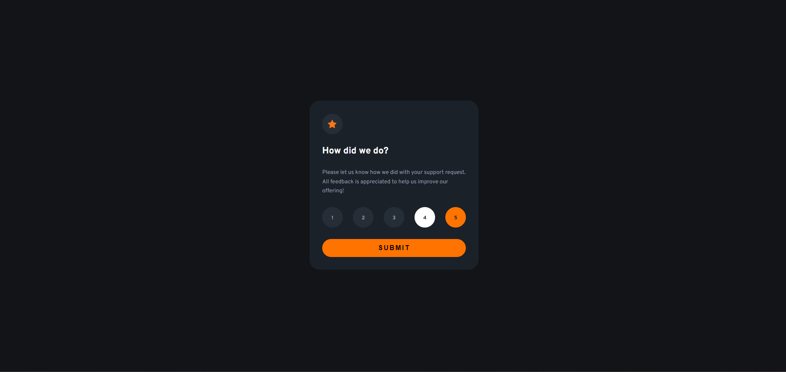
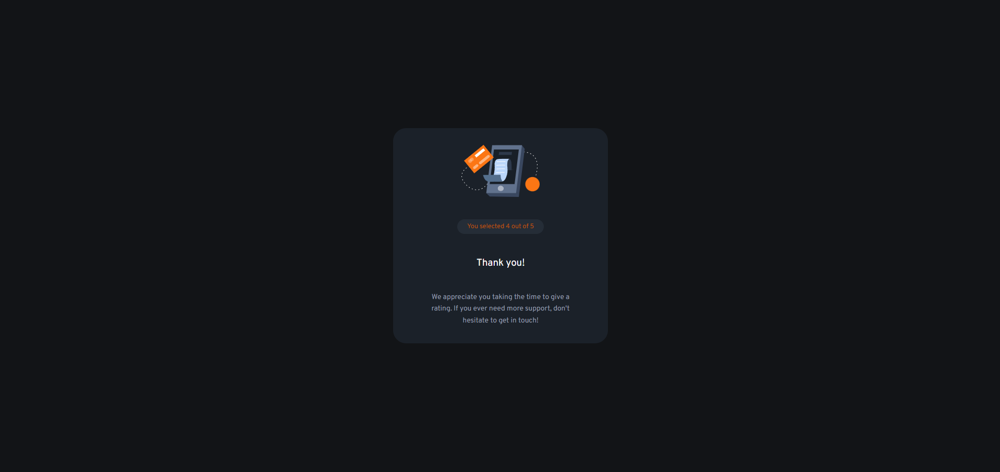

# Frontend Mentor - Interactive rating component solution

This is a solution to the [Interactive rating component challenge on Frontend Mentor](https://www.frontendmentor.io/challenges/interactive-rating-component-koxpeBUmI). Frontend Mentor challenges help you improve your coding skills by building realistic projects. 

## Table of contents

- [Overview](#overview)
  - [The challenge](#the-challenge)
  - [Screenshot](#screenshot)
- [My process](#my-process)
  - [Built with](#built-with)
  - [What I learned](#what-i-learned)
  - [Continued development](#continued-development)
- [Author](#author)


## Overview

### The challenge

Users should be able to:

- View the optimal layout for the app depending on their device's screen size
- See hover states for all interactive elements on the page
- Select and submit a number rating
- See the "Thank you" card state after submitting a rating

### Screenshot




## My process

### Built with

- Semantic HTML5 markup
- CSS custom properties
- Flexbox
- JavaScript


### What I learned

In this project I learned how to work more properly with the eventListener and the loop forEach.

```html
<h1>Some code I'm proud of</h1>
```

```js
for (let i = 0; i < selected.length; i++) {
  let selectedNumber = selected[i].innerHTML;
  selectedRating.innerHTML = `You selected ${selectedNumber} out of 5`;
}
```

### Continued development

Still need to get more confortable while working with DOM.


## Author

- Frontend Mentor - [@thiag8ito](https://www.frontendmentor.io/profile/thiag8ito)
- LinkedIn - [@Thiago Ryo Ito](https://www.linkedin.com/in/thiago-ryo-ito/)

<br>
<hr><br>
<hr><br>
<hr><br>
<br>

# Frontend Mentor - Interactive rating component solution

Essa é uma solução para [Interactive rating component challenge on Frontend Mentor](https://www.frontendmentor.io/challenges/interactive-rating-component-koxpeBUmI). Desafios do Frontend Mentor ajudam a melhorar as habilidades em programação ao construir projetos de mundo real. 

## Conteúdo 

- [Visão Geral](#visão-geral)
  - [O desafio](#o-desafio)
  - [Screenshot](#screenshot)
- [Minha solução](#minha-solução)
  - [Linguagens utilizadas](#linguagens-utilizadas)
  - [O que aprendi](#o-que-aprendi)
  - [Desenvolvimento contínuo](#desenvolvimento-contínuo)
- [Autor](#autor)


## Visão Geral

### O desafio
O usuário deverá ser capaz de:

- Ver o layout certo de acordo com o tamanho da tela do aparelho em que a página está sendo aberta
- Ver as mudanças nos elementos ao posicionar o mouse sobre eles
- Selecionar e enviar um numero de avaliação
- Ver o cartão de "obrigado" depois de mandar a avaliação

### Screenshot


## Minha solução

### Linguagens utilizadas

- Marcação semântica de HTML5
- CSS
- Flexbox
- JavaScript


### O que aprendi

Nesse projeto aprendi a trabalhar melhor com o método eventListener e o laço forEach.

```html
<h1>Uma parte de código que me orgulho</h1>
```

```js
for (let i = 0; i < selected.length; i++) {
  let selectedNumber = selected[i].innerHTML;
  selectedRating.innerHTML = `You selected ${selectedNumber} out of 5`;
}
```

### Desenvolvimento contínuo

Ainda preciso ficar mais confortável ao trabalhar com DOM.

## Author

- Frontend Mentor - [@thiag8ito](https://www.frontendmentor.io/profile/thiag8ito)
- LinkedIn - [@Thiago Ryo Ito](https://www.linkedin.com/in/thiago-ryo-ito/)
